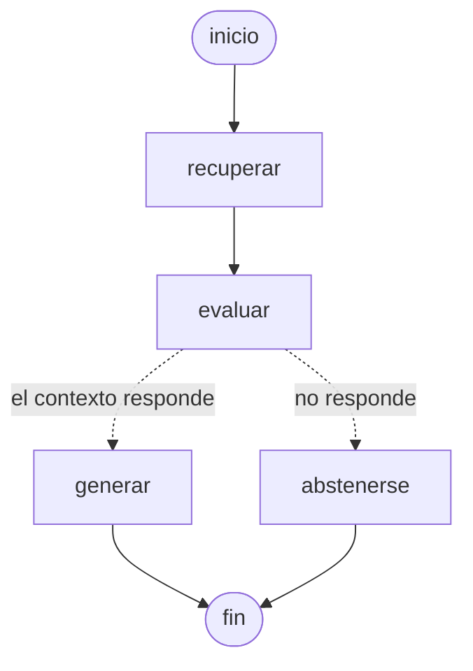

# RAG como grafo (LangGraph)

El RAG de [la carpeta de arriba](..) —recuperación híbrida sobre normativa laboral
española, escrito a mano y publicado en `rag.sdelapenya.dev`— reexpresado como
un grafo de estados con **LangGraph 1.2**, para hacer explícita la decisión que
allí estaba escondida dentro de un prompt: **cuándo NO hay que responder**.

No es un tutorial ni un clon: importa el código del RAG original tal cual (misma
recuperación, mismo índice, mismo conjunto de evaluación) y solo cambia la forma
en que se toman las decisiones.

## El grafo



| Nodo | Qué hace | Coste |
|------|----------|-------|
| `recuperar` | reescribe la pregunta al registro del documento y busca en el índice (k=3) | 1 llamada corta (~30 tokens de salida) |
| `evaluar` | ¿estos fragmentos contienen la respuesta? Suelo de similitud + modelo juez | 1 llamada corta (un par de tokens) |
| `generar` | redacta la respuesta citando `[n]` | 1 llamada al generador (~2.100 tokens) |
| `abstenerse` | cierra con «No encuentro esa información en los documentos.» y el motivo | 0 |

La arista condicional sale de `evaluar`. Ese es el cambio de fondo:

- **En el RAG original**, la abstención es la regla nº 1 del prompt de
  generación. Al modelo grande le llegan los fragmentos siempre, incluso cuando
  no valen, y unas veces se abstiene y otras no. El motivo no queda registrado
  en ninguna parte.
- **Aquí**, la decisión es un nodo con un modelo pequeño, ocurre *antes* de
  generar, y el porqué se queda escrito en el estado (`motivo`) — se puede
  enseñar, registrar y auditar.

## Cómo se usa

```bash
python3 grafo.py "¿cuántas horas extra puedo hacer al año?" -v
python3 grafo.py "¿cuál es el tipo general del IVA?" -v      # se abstiene
python3 grafo.py --mermaid                                   # el grafo, sin cargar el índice
python3 evaluar_grafo.py                                     # las 24 preguntas de evaluación
python3 calibrar_umbral.py                                   # de dónde sale el umbral
```

Con `-v` se ve la ruta que siguió la pregunta por el grafo, la reescritura, las
similitudes y qué modelo respondió:

```
  ruta        recuperar -> evaluar -> abstenerse
  reescritura ¿Cuál es la tasa general del Impuesto sobre el Valor Añadido en España?
  similitudes [0.8353, 0.8158, 0.8089]  (umbral 0.8)
  modelos     juez=qwen/qwen3.8-27b  respuesta=-
  ahorrado    una llamada a openai/gpt-oss-20b
```

## Resultados

Las mismas 24 preguntas del RAG original (20 con respuesta en el corpus, 4 de
materias que no regula), misma configuración: e5, semantic, k=3, generador a
**temperatura 0**.

> ⚠️ **La columna del grafo es del 03/09/2026, recién cambiado el juez**, y
> está **replicada el 06/09/2026**: dos tandas independientes, ambas sin
> respaldo de Gemini, con la misma ruta y el mismo acierto en las 24 preguntas
> una por una (solo cambian la redacción de 8 respuestas y el cronómetro). La
> columna del RAG original es del 03/09. Los números anteriores de este README
> eran del 12/08 **con un juez que ya no existe** (ver más abajo): no se pueden
> comparar de frente con estos.

| | RAG original | Este grafo |
|--|--|--|
| acierto de respuesta | 0,80 | 0,70 |
| abstención correcta (4 preguntas de fuera) | 4/4 | **4/4** |
| llamadas al modelo grande | 24/24 | **16/24** |
| abstenciones provocadas por el juez sobre preguntas buenas | — | **4** |

Lo que hay que leer en esa tabla:

- **El juez ahorra ahora 8 llamadas de 24, no 4** — y ese número tiene truco: 4
  son las preguntas sin respuesta (lo que se buscaba) y las otras 4 son cortes
  sobre preguntas que sí tienen respuesta en el corpus.
- **Cuatro abstenciones indebidas, y hay que mirarlas de una en una** porque no
  son lo mismo:
  - `despido-objetivo`, `teletrabajo-volver` y `teletrabajo-fichar`: el juez
    dice que la cuantía o el asunto **no están en los fragmentos recuperados**,
    y tiene razón — son los fallos de ventana y de recuperación que ya están
    descritos en el README del RAG. En la tanda del 12/08 estas tres acababan
    igualmente en «no lo encuentro», solo que **después** de pagar la llamada al
    modelo grande. Mismo resultado, más barato.
  - `teletrabajo-control` es **un corte malo de verdad**: el artículo 22
    («Facultades de control empresarial») y el 17 están entre los fragmentos y
    el juez contesta «no regulan la vigilancia de la actividad». Es una pregunta
    que antes se respondía bien y ahora se pierde. No está maquillado: es el
    precio del juez nuevo.
- **El juez anterior no cortaba nada** (`cortadas_por_el_juez: []` el 12/08), y
  eso hacía muy fácil presumir de «cero abstenciones indebidas». Un filtro que
  no filtra nunca no demuestra que sea prudente, solo que no está haciendo su
  trabajo. El de ahora sí corta, acierta en 3 de sus 4 cortes y falla 1.
- **De los 10 puntos de acierto que separan las dos columnas, solo 5 son del
  juez.** El grafo no toca la generación: son las mismas fuentes y el mismo
  prompt. `teletrabajo-control` sí es cosa del juez (lo corta). La otra pregunta
  es `teletrabajo-regular`, que el juez **deja pasar** con un veredicto correcto
  y a la que el generador contesta «no lo encuentro» aun teniendo el artículo 1
  delante; el RAG original, en la misma tanda y con los mismos fragmentos, la
  acierta. La sospecha inicial fue que era ruido de muestreo —Groq sirve
  `gpt-oss-20b` en lotes y ni a temperatura 0 devuelve el mismo texto siempre—,
  pero **la segunda tanda del 06/09 la vuelve a perder exactamente igual**: es
  un fallo reproducible del generador, no una mala tirada.
- Por eso la evaluación separa `cortadas_por_el_juez` de `abstenidas_al_generar`;
  sumarlas escondería de quién es la culpa.

Recall@3 (0,90) y MRR (0,85) no se recalculan: la recuperación es literalmente
la misma función, así que son los números de `evaluate.py` sin tocar.

### El juez, en su segunda versión

La primera versión del nodo `evaluar` **tumbó 5 preguntas buenas de 20**, todas
por el mismo motivo: pedía la palabra literal. Decía *«el texto no menciona el
fichaje»* cuando la ley dice «registro horario», o *«no menciona un plazo en
días»* cuando el artículo pide «el treinta por ciento de la jornada en tres
meses».

Es el mismo desajuste que el RAG ya resuelve al buscar —lenguaje corriente
contra lenguaje legal— y la solución estaba en el estado sin usar: **al juez
ahora se le pasa también la reescritura formal de la pregunta**, que ya se
calculó en `recuperar` y no cuesta nada. Con eso, y con un prompt que exige
literalidad solo donde debe (una cifra, un importe, un plazo que no aparece),
las 5 volvieron a pasar sin que se colara ninguna de las 4 de fuera.

El prompt no ha cambiado desde entonces, pero **el modelo que lo lee sí** (03/09,
ver arriba), y con Qwen una de aquellas 5 —`teletrabajo-control`— vuelve a
caer. Se probó a añadirle al prompt una regla general para las preguntas de
sí/no: **no la arregla**, así que la regla no está puesta. Un prompt no es una
propiedad del sistema: es una propiedad del par prompt-modelo.

## Decisiones

**Entorno virtual y carpeta aparte.** El RAG del directorio padre sirve un proceso en
producción (`rag-demo.service`, puerto 8006). Instalar LangGraph en su entorno
para probar algo es arriesgar la demo que sí funciona por una dependencia
transitiva. Aquí hay un `.venv` propio con las mismas versiones de las librerías
compartidas; el código y el índice del RAG se leen de su sitio, sin copiarlos ni
modificarlos. El puente son diez líneas: [`puente.py`](puente.py).

**El juez es una llamada barata** (`qwen/qwen3.8-27b` con
`reasoning_effort="none"`). Decidir si un
texto contiene un dato es clasificar, no redactar: la salida son un par de
tokens frente a una respuesta entera, y sale de una cuota distinta a la del
generador. Si el filtro costara lo mismo que la respuesta, no filtraría nada:
solo añadiría latencia.

Hasta el 16/08/2026 este papel lo hacía `llama-3.1-8b-instant`, que Groq retiró.
Era literalmente un modelo pequeño; el relevo no lo es, pero el argumento se
sostiene igual porque lo que se ahorra son los tokens de redactar.

**El 03/09/2026 hubo que cambiarlo otra vez, y el fallo es la lección**: Groq
retiró también `llama-3.3-70b-versatile` y aquí nadie se enteró, porque el 404
que devolvía la API no lo captura `_generar` —que solo reintenta los 429— y
reventaba el grafo entero en cualquier pregunta que pasara del umbral. Un
modelo cableado en un default es una dependencia externa con fecha de
caducidad y sin aviso. El relevo es Qwen porque del catálogo que queda gpt-oss
es el que redacta, y usarlo de juez gastaría justo la cuota que este filtro
existe para ahorrar.

**El modelo del juez va fijo, no heredado del que reescribe la pregunta** — y
eso es una cicatriz, no una preferencia. Lo heredaba, y el 14/08/2026 el RAG se
pasó a `qwen3.6-27b` (y el 03/09/2026 a `qwen3.8-27b`, cuando Groq retiró el
anterior), que razona y necesita `reasoning_effort="none"` en su
llamada. El juez habría heredado el modelo pero no el ajuste: con `max_tokens=60`
habría devuelto el bloque de razonamiento en vez de un veredicto y, como ante un
veredicto raro este grafo tira hacia adelante a propósito, **habría dejado de
abstenerse siempre, sin lanzar un solo error**. Un acoplamiento así no lo caza un
test: se ve en la métrica, semanas después.

**El umbral de similitud es un suelo, no un discriminador — y eso está medido.**
La idea original era cortar por similitud antes de gastar ni la llamada al juez.
[`calibrar_umbral.py`](calibrar_umbral.py) dice que no se puede: con e5 las 20
preguntas del corpus caen entre 0,828 y 0,895 y las 4 de fuera entre 0,833 y
0,862 — **se solapan**. e5 comprime todos los cosenos en una franja estrecha, así
que no hay umbral que separe «lo que está en el corpus» de «lo que no». El
umbral se queda en 0,80, por debajo de todo lo observado, donde sí sirve: caza
preguntas ajenas al dominio (*«¿cuál es la capital de Mongolia?»* → 0,72) sin
gastar una llamada. Lo fino lo hace el juez. La salida de la calibración está en
[`calibracion-umbral.txt`](calibracion-umbral.txt).

**Ante una respuesta rara del juez, se genera.** Si el veredicto no empieza por
«NO», se sigue a `generar`. Preferimos gastar una llamada de más a callarnos ante
una pregunta que sí tenía respuesta en los documentos.

## Límites

- Es un grafo lineal con una bifurcación: no hay ciclos, ni memoria entre
  preguntas, ni checkpointer. LangGraph luce cuando hay reintentos y estado
  persistente; aquí se usa lo que el problema pide y nada más.
- No está publicado: se ejecuta por CLI. La demo web sigue siendo la del RAG
  original, en `rag.sdelapenya.dev`.
- El conjunto de evaluación son 24 preguntas. Sirve para comparar dos
  variantes del mismo sistema, no para afirmar nada en general.
- Un juez con el mismo tipo de modelo que el generador comparte sus puntos
  ciegos. Lo honesto sería medirlo contra un juez humano; con 24 preguntas se
  puede, pero aún no está hecho.

## Ficheros

| Fichero | Qué es |
|---------|--------|
| [`grafo.py`](grafo.py) | el grafo, los cuatro nodos y la CLI |
| [`puente.py`](puente.py) | hace importable el RAG del directorio padre sin copiar código |
| [`evaluar_grafo.py`](evaluar_grafo.py) | pasa las 24 preguntas por el grafo |
| [`calibrar_umbral.py`](calibrar_umbral.py) | mide si la similitud puede decidir sola |
| `eval-grafo.json` | detalle pregunta a pregunta de la última evaluación |

## Instalación

```bash
python3 -m venv .venv
.venv/bin/pip install -r requirements.txt
```

Necesita `GROQ_API_KEY` (y opcionalmente `GEMINI_API_KEY` como respaldo) en el
entorno o en un fichero de claves (`RAG_ENV_FILE=/ruta/claves.env`), igual que
el RAG original, y que el índice del RAG (`../index/`) esté construido con
`ingest.py`. Si el RAG está en otra ruta: `RAG_DIR=/ruta/al/rag python3 grafo.py ...`
